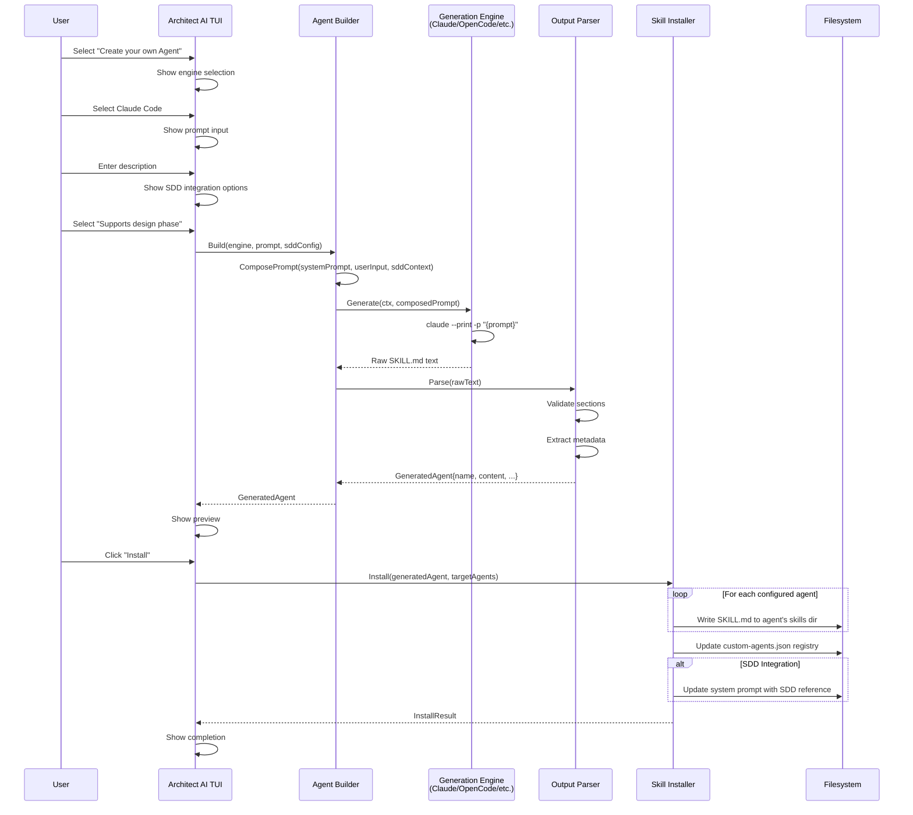

# PRD: Agent Builder — Create Your Own Sub-Agent

> **Your ecosystem, your rules. Build custom AI sub-agents from the TUI — no code required.**

**Version**: 0.1.0-draft
**Author**: Gentleman Programming
**Date**: 2026-04-03
**Status**: Draft
**Parent PRD**: [PRD.md](PRD.md) (Gentleman AI Installer)

---

## 1. Problem Statement

The Gentleman AI ecosystem ships with a powerful set of pre-built skills and SDD phases. But every developer works differently. A frontend architect needs a design system reviewer. A security engineer needs a vulnerability scanner agent. A technical writer needs a documentation generator.

**Today, creating a custom sub-agent requires:**

1. Understanding the skill file format (`SKILL.md`) for each AI agent
2. Knowing where each agent stores its configuration (Claude Code: `~/.claude/skills/`, OpenCode: `~/.config/opencode/skills/`, etc.)
3. Writing the system prompt, triggers, and patterns manually
4. Duplicating the skill across every AI agent you use
5. If it's SDD-related, understanding the orchestrator config and how to register a new phase

**This is a barrier that shouldn't exist.** If you can describe what you want your agent to do in natural language, the ecosystem should generate it, validate it, and install it across all your configured AI agents — from a single TUI flow.

---

## 2. Vision

**A guided TUI experience where you describe what you want, and the ecosystem uses one of your installed AI agents to generate a production-ready sub-agent skill — installed across all your tools instantly.**

Think of it as the "Create Agent" flow from Claude's `/agents` command, but:
- **Cross-agent**: generates once, installs everywhere (Claude Code, OpenCode, Gemini CLI, Cursor, etc.)
- **SDD-aware**: can optionally integrate as a new SDD phase or as support for an existing phase
- **Ecosystem-native**: the generated agent has access to Engram (persistent memory), MCP servers, and follows the Gentleman skill format
- **Preview before install**: you see exactly what will be generated before it touches your filesystem

**Before**: "I want an agent that reviews my CSS for accessibility... I guess I need to write a SKILL.md manually, figure out triggers, and copy it to 4 different directories."

**After**: Select "Create your own Agent" → pick your AI engine → describe what you want → preview the generated skill → it's installed everywhere. Done.

---

## 3. Target Users

### Primary
- **Professional developers** who want specialized AI assistance beyond the pre-built skills
- **Team leads** who want to create standardized agents for their team's workflow (e.g., "our API review agent")
- **SDD users** who need custom phases or phase augmentation for their specific domain

### Secondary
- **Educators** creating custom teaching agents
- **Open source maintainers** who want project-specific review agents

---

## 4. User Experience

### 4.1 Entry Point — Welcome Screen

The Agent Builder is a **top-level menu option** on the Welcome screen, alongside the existing options:

```
┌──────────────────────────────────────────────────────────────────┐
│                                                                  │
│   ╔═══════════════════════════════════════╗                      │
│   ║   ARCHITECT AI                        ║                      │
│   ╚═══════════════════════════════════════╝                      │
│                                                                  │
│   Supercharge your AI agents. v0.x.x                             │
│                                                                  │
│   Menu                                                           │
│                                                                  │
│     Start installation                                           │
│     Upgrade tools                                                │
│     Sync configs                                                 │
│     Upgrade + Sync                                               │
│     Configure models                                             │
│   ★ Create your own Agent                                        │
│     Manage backups                                               │
│     Quit                                                         │
│                                                                  │
│   j/k: navigate • enter: select • q: quit                       │
└──────────────────────────────────────────────────────────────────┘
```

### 4.2 Agent Builder Flow

```
"Create your own Agent"
         │
         ▼
┌─────────────────────────────────┐
│  Step 1: Choose Your AI Engine   │
│                                  │
│  Which installed agent should    │
│  help you build your sub-agent?  │
│                                  │
│  ★ Claude Code (installed)       │  ← Uses claude --print to generate
│  ○ OpenCode (installed)          │  ← Uses opencode run to generate
│  ○ Gemini CLI (installed)        │  ← Uses gemini -p to generate
│  ○ Codex (installed)             │  ← Uses codex exec to generate
│                                  │
│  Only installed agents shown.    │
└──────────┬──────────────────────┘
           │
           ▼
┌─────────────────────────────────┐
│  Step 2: Describe Your Agent     │
│                                  │
│  Tell us what you want your      │
│  agent to do. Be as specific     │
│  as you can — the more detail,   │
│  the better the result.          │
│                                  │
│  Examples:                       │
│  • "Review CSS for a11y issues"  │
│  • "Generate API docs from code" │
│  • "Validate DB migrations"      │
│                                  │
│  ┌──────────────────────────┐    │
│  │ I want an agent that     │    │
│  │ reviews my React         │    │
│  │ components for           │    │
│  │ accessibility compliance │    │
│  │ following WCAG 2.1 AA    │    │
│  │ standards.               │    │
│  └──────────────────────────┘    │
│                                  │
│  [Continue]  [Back]              │
└──────────┬──────────────────────┘
           │
           ▼
┌─────────────────────────────────┐
│  Step 3: SDD Integration         │
│                                  │
│  Should this agent be part of    │
│  the SDD (Spec-Driven Dev)       │
│  workflow?                       │
│                                  │
│  ★ Standalone                    │  ← Independent skill, not part of SDD
│  ○ New SDD Phase                 │  ← Adds as a new phase in the pipeline
│  ○ Support for existing phase    │  ← Augments an existing SDD phase
│                                  │
│  [Continue]  [Back]              │
└──────────┬──────────────────────┘
           │
           ├── If "New SDD Phase":
           │   ┌──────────────────────────────┐
           │   │  Where in the SDD pipeline?   │
           │   │                               │
           │   │  explore → propose → spec     │
           │   │  → design → YOUR PHASE        │
           │   │  → tasks → apply → verify     │
           │   │  → archive                    │
           │   │                               │
           │   │  Insert after:                │
           │   │  ○ explore                    │
           │   │  ○ propose                    │
           │   │  ○ spec                       │
           │   │  ★ design                     │
           │   │  ○ tasks                      │
           │   │  ○ apply                      │
           │   │  ○ verify                     │
           │   └──────────────────────────────┘
           │
           ├── If "Support for existing phase":
           │   ┌──────────────────────────────┐
           │   │  Which phase to support?      │
           │   │                               │
           │   │  ○ explore                    │
           │   │  ○ propose                    │
           │   │  ○ spec                       │
           │   │  ★ design                     │
           │   │  ○ tasks                      │
           │   │  ○ apply                      │
           │   │  ○ verify                     │
           │   │  ○ archive                    │
           │   └──────────────────────────────┘
           │
           ▼
┌─────────────────────────────────┐
│  Step 4: Generating...           │
│                                  │
│  Using Claude Code to generate   │
│  your sub-agent...               │
│                                  │
│  [████████████░░░░] 75%          │
│                                  │
│  ◌ Analyzing your description    │
│  ✓ Generating skill definition   │
│  ◌ Creating trigger patterns     │
│  ◌ Building agent instructions   │
└──────────┬──────────────────────┘
           │
           ▼
┌─────────────────────────────────────────────────────────────┐
│  Step 5: Preview Your Agent                                  │
│                                                              │
│  Name: a11y-reviewer                                         │
│  Description: Reviews React components for WCAG 2.1 AA       │
│               accessibility compliance                       │
│  Trigger: When reviewing React/JSX files for accessibility   │
│  SDD: Supports "design" phase                                │
│  Engram: ✓ (reads project patterns, saves a11y decisions)    │
│                                                              │
│  ── Generated Skill ──────────────────────────────────────   │
│  │ # A11y Reviewer                                       │   │
│  │                                                       │   │
│  │ ## Description                                        │   │
│  │ Reviews React components for WCAG 2.1 AA compliance.  │   │
│  │ Checks semantic HTML, ARIA attributes, color contrast, │   │
│  │ keyboard navigation, and focus management.            │   │
│  │                                                       │   │
│  │ ## Trigger                                            │   │
│  │ When reviewing React/JSX/TSX files for accessibility  │   │
│  │ compliance, a11y audits, or WCAG validation.          │   │
│  │                                                       │   │
│  │ ## Instructions                                       │   │
│  │ ...                                                   │   │
│  └───────────────────────────────────────────────────────┘   │
│                                                              │
│  Will be installed to:                                       │
│    • ~/.claude/skills/a11y-reviewer/SKILL.md                 │
│    • ~/.config/opencode/skills/a11y-reviewer/SKILL.md        │
│                                                              │
│  [Install]  [Edit]  [Regenerate]  [Back]                     │
└──────────┬──────────────────────────────────────────────────┘
           │
           ├── If "Edit":
           │   Opens $EDITOR with the generated SKILL.md
           │   Returns to preview after editor closes
           │
           ├── If "Regenerate":
           │   Returns to generating screen with same prompt
           │
           ▼
┌─────────────────────────────────┐
│  Step 6: Installing              │
│                                  │
│  Installing "a11y-reviewer"...   │
│                                  │
│  ✓ Claude Code — skill installed │
│  ✓ OpenCode — skill installed    │
│  ✓ Skill registered in catalog   │
│  ✓ SDD integration configured   │
│                                  │
│  Done! Your agent is ready.      │
│                                  │
│  To use it, ask your AI agent    │
│  to review a component for       │
│  accessibility.                  │
│                                  │
│  [Done]                          │
└─────────────────────────────────┘
```

### 4.3 Managing Custom Agents

After creating agents, users need to manage them. A future iteration will add a "Manage custom agents" submenu (out of scope for V1, but architecture must support it):

- List all custom agents
- Edit an existing agent (re-open in preview)
- Delete a custom agent (removes from all configured AI agents)
- Export an agent (for sharing — future marketplace feature)

For V1, custom agents can be managed manually by editing/deleting the SKILL.md files.

---

## 5. Agent Generation System

### 5.1 Generation Engine

The Agent Builder uses **one of the user's installed AI agents** as the generation engine. This is a key architectural decision — we don't ship our own AI model; we leverage whatever the user already has.

#### Engine Abstraction

Each supported AI agent exposes a different CLI interface for non-interactive use:

| Agent | Command | Mode |
|-------|---------|------|
| Claude Code | `claude --print -p "{prompt}"` | Pipe prompt, get text output |
| OpenCode | `opencode run "{prompt}"` | Run mode, text output |
| Gemini CLI | `gemini -p "{prompt}"` | Pipe mode |
| Codex | `codex exec "{prompt}"` | Exec mode |

The system needs a `GenerationEngine` interface:

```go
type GenerationEngine interface {
    // Agent returns the ID of the AI agent used for generation.
    Agent() model.AgentID

    // Generate sends a prompt and returns the raw text output.
    Generate(ctx context.Context, prompt string) (string, error)

    // Available returns true if the agent binary is installed and accessible.
    Available() bool
}
```

### 5.2 Generation Prompt Strategy

The prompt sent to the AI engine is critical. It must produce a well-structured skill file that follows the ecosystem's conventions.

#### System Prompt (injected before user input)

```
You are an expert AI skill creator for the Gentleman AI ecosystem.
Your task is to generate a SKILL.md file based on the user's description.

The SKILL.md format must follow this structure:

# {Skill Name}

## Description
{What this skill does — 1-2 sentences}

## Trigger
{When this skill should be activated — specific file types, commands, or contexts}

## Instructions
{Detailed instructions for the AI agent when this skill is active}

## Rules
{Specific constraints, patterns, or conventions the agent must follow}

## Examples
{Concrete examples of input/output or behavior}

CONSTRAINTS:
- The skill MUST be self-contained in a single SKILL.md file
- Instructions MUST be actionable and specific, not vague
- Trigger conditions MUST be precise enough to avoid false activations
- If the user mentions SDD integration, include a section on how this skill
  interacts with the SDD phase it supports
- Include Engram integration instructions (when to save decisions, when to search
  for past context)
- Generate a kebab-case name derived from the description

OUTPUT FORMAT:
Return ONLY the SKILL.md content. No explanations, no wrapping, no code fences.
Start directly with "# {Name}".
```

#### User Prompt Composition

The final prompt combines:
1. The system prompt (above)
2. The user's description (from Step 2)
3. SDD integration context (if selected in Step 3)
4. Additional context about installed agents and ecosystem capabilities

```
{system_prompt}

USER REQUEST:
{user_description}

ADDITIONAL CONTEXT:
- This skill will be installed across these agents: {agent_list}
- SDD Integration: {standalone | new_phase_after_X | supports_phase_X}
- The agent has access to Engram persistent memory (mem_save, mem_search, mem_context)
- The agent can use MCP servers: {installed_mcp_list}
```

### 5.3 Output Parsing

The generation engine returns raw text. The builder must:

1. **Validate structure**: Ensure the output contains required sections (Description, Trigger, Instructions)
2. **Extract metadata**: Parse the skill name, description, and trigger for display in the preview
3. **Clean up**: Remove any code fences, preamble, or trailing text the AI might add
4. **Generate name**: Derive a kebab-case directory name from the skill title

```go
type GeneratedAgent struct {
    Name        string // kebab-case, e.g. "a11y-reviewer"
    Title       string // Human-readable, e.g. "A11y Reviewer"
    Description string // From ## Description section
    Trigger     string // From ## Trigger section
    Content     string // Full SKILL.md content
    SDDConfig   *SDDIntegration // nil if standalone
}

type SDDIntegration struct {
    Mode          SDDIntegrationMode // standalone | new_phase | phase_support
    TargetPhase   string             // e.g. "design" — which phase to support or insert after
    PhaseName     string             // e.g. "a11y-review" — name of new SDD phase (if new_phase)
}

type SDDIntegrationMode string

const (
    SDDStandalone    SDDIntegrationMode = "standalone"
    SDDNewPhase      SDDIntegrationMode = "new-phase"
    SDDPhaseSupport  SDDIntegrationMode = "phase-support"
)
```

---

## 6. Skill Installation

### 6.1 Where Skills Get Installed

Custom agent skills follow the SAME installation pattern as built-in skills. The existing `Adapter.SkillsDir()` method from the agent interface provides the correct path for each agent:

| Agent | Skill Directory | File Path |
|-------|----------------|-----------|
| Claude Code | `~/.claude/skills/` | `~/.claude/skills/{name}/SKILL.md` |
| OpenCode | `~/.config/opencode/skills/` | `~/.config/opencode/skills/{name}/SKILL.md` |
| Gemini CLI | `~/.gemini/skills/` | `~/.gemini/skills/{name}/SKILL.md` |
| Cursor | `~/.cursor/skills/` | `~/.cursor/skills/{name}/SKILL.md` |
| VSCode | `~/.vscode/skills/` | `~/.vscode/skills/{name}/SKILL.md` |
| Codex | `~/.codex/skills/` | `~/.codex/skills/{name}/SKILL.md` |
| Windsurf | `~/.windsurf/skills/` | `~/.windsurf/skills/{name}/SKILL.md` |
| Antigravity | `~/.antigravity/skills/` | `~/.antigravity/skills/{name}/SKILL.md` |

The installer writes the SAME `SKILL.md` to ALL agents that were configured during the initial setup (detected via the ecosystem's state file or by scanning which agent skill directories exist).

### 6.2 Custom Agent Registry

To track which custom agents the user has created (for future management), a local registry file is maintained:

```
~/.config/architect-ai/custom-agents.json
```

```json
{
  "version": 1,
  "agents": [
    {
      "name": "a11y-reviewer",
      "title": "A11y Reviewer",
      "description": "Reviews React components for WCAG 2.1 AA accessibility compliance",
      "created_at": "2026-04-03T14:30:00Z",
      "generation_engine": "claude-code",
      "sdd_integration": {
        "mode": "phase-support",
        "target_phase": "design"
      },
      "installed_agents": ["claude-code", "opencode"]
    }
  ]
}
```

### 6.3 SDD Integration Installation

When the custom agent has SDD integration, additional configuration is needed:

#### Phase Support Mode

The generated skill includes SDD-aware instructions. The orchestrator's system prompt is updated to include a reference to the custom skill:

```markdown
<!-- architect-ai:custom-agent:{name} -->
## Custom Agent: {Title}
When executing the "{target_phase}" phase, also load and apply the "{name}" skill
for additional validation/support.
<!-- /architect-ai:custom-agent:{name} -->
```

This is injected into the agent's system prompt using the existing `StrategyMarkdownSections` approach (marker-based injection that doesn't clobber user content).

#### New Phase Mode

A new SDD phase skill is created with the standard SDD skill structure. The orchestrator's dependency graph and phase list are updated to include the new phase at the specified position.

**Important**: This is a more complex integration. For V1, we inject the phase reference into the orchestrator's system prompt. The orchestrator (being an AI) will interpret the dependency graph and execute accordingly. No code changes to the SDD engine are needed — it's all prompt-driven.

---

## 7. Technical Architecture

### 7.1 Package Structure

```
internal/
├── agentbuilder/          # Core agent builder logic
│   ├── builder.go         # Main builder orchestrator
│   ├── engine.go          # GenerationEngine interface + implementations
│   ├── parser.go          # Output parsing and validation
│   ├── installer.go       # Skill file installation across agents
│   ├── registry.go        # Custom agent registry (JSON file management)
│   ├── prompt.go          # Prompt composition logic
│   └── sdd.go             # SDD integration logic
├── tui/
│   ├── screens/
│   │   ├── agent_builder_engine.go      # Step 1: Engine selection
│   │   ├── agent_builder_prompt.go      # Step 2: Description input
│   │   ├── agent_builder_sdd.go         # Step 3: SDD integration
│   │   ├── agent_builder_generating.go  # Step 4: Generation progress
│   │   ├── agent_builder_preview.go     # Step 5: Preview + edit
│   │   └── agent_builder_complete.go    # Step 6: Installation complete
│   ├── model.go           # Add new Screen constants + AgentBuilder state
│   └── router.go          # Add agent builder routes
```

### 7.2 New Screen Constants

```go
const (
    // ... existing screens ...
    ScreenAgentBuilderEngine    Screen = iota + 100 // Offset to avoid conflicts
    ScreenAgentBuilderPrompt
    ScreenAgentBuilderSDD
    ScreenAgentBuilderSDDPhase
    ScreenAgentBuilderGenerating
    ScreenAgentBuilderPreview
    ScreenAgentBuilderInstalling
    ScreenAgentBuilderComplete
)
```

### 7.3 Model Extensions

```go
type Model struct {
    // ... existing fields ...

    // Agent Builder state
    AgentBuilder AgentBuilderState
}

type AgentBuilderState struct {
    // Step 1: Selected generation engine
    Engine         model.AgentID
    AvailableEngines []model.AgentID

    // Step 2: User prompt
    PromptText     string
    PromptCursorPos int

    // Step 3: SDD integration
    SDDMode        SDDIntegrationMode
    SDDTargetPhase string

    // Step 4: Generation
    Generating     bool
    GenerationErr  error

    // Step 5: Preview
    Generated      *GeneratedAgent
    PreviewScroll  int

    // Step 6: Installation
    Installing     bool
    InstallResult  *InstallResult
}
```

### 7.4 Router Integration

The agent builder has its own sub-flow that's independent of the main installation flow:

```go
var agentBuilderRoutes = map[Screen]Route{
    ScreenAgentBuilderEngine:     {Backward: ScreenWelcome},
    ScreenAgentBuilderPrompt:     {Backward: ScreenAgentBuilderEngine},
    ScreenAgentBuilderSDD:        {Backward: ScreenAgentBuilderPrompt},
    ScreenAgentBuilderSDDPhase:   {Backward: ScreenAgentBuilderSDD},
    ScreenAgentBuilderGenerating: {Backward: ScreenAgentBuilderPrompt},
    ScreenAgentBuilderPreview:    {Forward: ScreenAgentBuilderInstalling, Backward: ScreenAgentBuilderPrompt},
    ScreenAgentBuilderInstalling: {Forward: ScreenAgentBuilderComplete},
    ScreenAgentBuilderComplete:   {Backward: ScreenWelcome},
}
```

### 7.5 Generation Engine Implementations

Each engine implementation wraps the agent's CLI:

```go
// ClaudeEngine generates skills using Claude Code's --print mode.
type ClaudeEngine struct {
    binaryPath string
}

func (e *ClaudeEngine) Generate(ctx context.Context, prompt string) (string, error) {
    cmd := exec.CommandContext(ctx, e.binaryPath, "--print", "-p", prompt)
    output, err := cmd.Output()
    if err != nil {
        return "", fmt.Errorf("claude generation failed: %w", err)
    }
    return string(output), nil
}

// OpenCodeEngine generates skills using OpenCode's run mode.
type OpenCodeEngine struct {
    binaryPath string
}

func (e *OpenCodeEngine) Generate(ctx context.Context, prompt string) (string, error) {
    cmd := exec.CommandContext(ctx, e.binaryPath, "run", prompt)
    output, err := cmd.Output()
    if err != nil {
        return "", fmt.Errorf("opencode generation failed: %w", err)
    }
    return string(output), nil
}
```

### 7.6 Sequence Diagram — Generation Flow



### 7.7 Architecture Diagram — Component Relationships

```mermaid
graph TB
    subgraph TUI_LAYER["TUI Layer (Bubbletea)"]
        WELCOME[Welcome Screen<br/>+ "Create your own Agent"]
        AB_ENGINE[Engine Selection]
        AB_PROMPT[Prompt Input]
        AB_SDD[SDD Integration]
        AB_GENERATING[Generating Screen]
        AB_PREVIEW[Preview Screen]
        AB_INSTALLING[Installing Screen]
        AB_COMPLETE[Complete Screen]

        WELCOME --> AB_ENGINE
        AB_ENGINE --> AB_PROMPT
        AB_PROMPT --> AB_SDD
        AB_SDD --> AB_GENERATING
        AB_GENERATING --> AB_PREVIEW
        AB_PREVIEW --> AB_INSTALLING
        AB_INSTALLING --> AB_COMPLETE
        AB_COMPLETE --> WELCOME
    end

    subgraph BUILDER_LAYER["Agent Builder Core"]
        BUILDER[Builder Orchestrator]
        PROMPT_COMP[Prompt Composer]
        PARSER[Output Parser]
        REGISTRY[Custom Agent Registry]
    end

    subgraph ENGINE_LAYER["Generation Engines"]
        ENGINE_IF{GenerationEngine<br/>Interface}
        CLAUDE_ENG[Claude Engine<br/>claude --print]
        OC_ENG[OpenCode Engine<br/>opencode run]
        GEM_ENG[Gemini Engine<br/>gemini -p]
        CDX_ENG[Codex Engine<br/>codex exec]

        ENGINE_IF --> CLAUDE_ENG
        ENGINE_IF --> OC_ENG
        ENGINE_IF --> GEM_ENG
        ENGINE_IF --> CDX_ENG
    end

    subgraph INSTALLER_LAYER["Skill Installer"]
        SKILL_INST[Skill Installer]
        SDD_INT[SDD Integrator]
        AGENT_ADAPTER[Agent Adapters<br/>SkillsDir / SystemPromptStrategy]
    end

    subgraph STORAGE["Storage"]
        SKILLS_DIR["~/.{agent}/skills/{name}/SKILL.md"]
        REGISTRY_FILE["~/.config/architect-ai/custom-agents.json"]
        SYS_PROMPT["Agent system prompts<br/>(CLAUDE.md / AGENTS.md / etc.)"]
    end

    AB_GENERATING --> BUILDER
    BUILDER --> PROMPT_COMP
    BUILDER --> ENGINE_IF
    BUILDER --> PARSER
    AB_INSTALLING --> SKILL_INST
    SKILL_INST --> AGENT_ADAPTER
    SKILL_INST --> SDD_INT
    SKILL_INST --> REGISTRY
    SKILL_INST --> SKILLS_DIR
    REGISTRY --> REGISTRY_FILE
    SDD_INT --> SYS_PROMPT

    style TUI_LAYER fill:#1a1b26,stroke:#E0C15A,color:#E0C15A
    style BUILDER_LAYER fill:#1a1b26,stroke:#7FB4CA,color:#7FB4CA
    style ENGINE_LAYER fill:#1a1b26,stroke:#B7CC85,color:#B7CC85
    style INSTALLER_LAYER fill:#1a1b26,stroke:#957FB8,color:#957FB8
    style STORAGE fill:#1a1b26,stroke:#CB7C94,color:#CB7C94
```

---

## 8. SDD Integration — Deep Dive

### 8.1 Standalone Mode

The simplest mode. The generated skill is a regular skill file — no SDD awareness. It triggers based on file context or user invocation, just like `react-19` or `typescript`.

### 8.2 Phase Support Mode

The custom agent **augments** an existing SDD phase. Example: an "a11y-reviewer" that supports the "design" phase.

**How it works at runtime:**

1. The SDD orchestrator reaches the `design` phase
2. The orchestrator's system prompt includes a reference to the custom agent:
   ```
   When executing the "design" phase, also consider loading the
   "a11y-reviewer" skill for accessibility validation of the design.
   ```
3. The AI agent (being intelligent) reads the custom skill and incorporates its guidance into the design phase output
4. The custom skill's Engram instructions tell the agent to save accessibility decisions to memory

**What gets modified:**
- The agent's system prompt (CLAUDE.md, AGENTS.md, etc.) gets a new marker section referencing the custom skill
- The custom SKILL.md includes instructions specific to the supported phase

### 8.3 New Phase Mode

The custom agent becomes a **new phase** in the SDD pipeline. Example: an "a11y-audit" phase that runs between "design" and "tasks".

**How it works at runtime:**

1. The SDD orchestrator's dependency graph is updated:
   ```
   proposal -> specs -> design -> a11y-audit -> tasks -> apply -> verify -> archive
   ```
2. The custom skill follows the SDD phase contract:
   - Reads artifacts from the previous phase
   - Writes its own artifact to Engram (topic key: `sdd/{change}/a11y-audit`)
   - Returns the standard phase result: `status`, `executive_summary`, `artifacts`, `next_recommended`

**What gets modified:**
- A new SDD skill file is created following the phase skill pattern
- The orchestrator's system prompt is updated with the modified dependency graph
- The Engram topic key format is documented in the skill

### 8.4 SDD Phase Positions

The user selects where in the pipeline to insert the new phase:

| Insert After | Resulting Pipeline |
|--------------|-------------------|
| explore | explore → **custom** → propose → spec → design → tasks → apply → verify → archive |
| propose | explore → propose → **custom** → spec → design → tasks → apply → verify → archive |
| spec | explore → propose → spec → **custom** → design → tasks → apply → verify → archive |
| design | explore → propose → spec → design → **custom** → tasks → apply → verify → archive |
| tasks | explore → propose → spec → design → tasks → **custom** → apply → verify → archive |
| apply | explore → propose → spec → design → tasks → apply → **custom** → verify → archive |
| verify | explore → propose → spec → design → tasks → apply → verify → **custom** → archive |

---

## 9. Requirements

### Functional Requirements

| ID | Requirement | Priority |
|----|------------|----------|
| R-AB-01 | The Agent Builder MUST be accessible from the Welcome screen as a top-level menu option | P0 |
| R-AB-02 | The Agent Builder MUST only show installed AI agents as generation engine options | P0 |
| R-AB-03 | The Agent Builder MUST accept free-form natural language description as input | P0 |
| R-AB-04 | The Agent Builder MUST generate a valid SKILL.md file using the selected AI engine | P0 |
| R-AB-05 | The Agent Builder MUST show a preview of the generated skill before installation | P0 |
| R-AB-06 | The Agent Builder MUST install the generated skill to ALL configured AI agents | P0 |
| R-AB-07 | The Agent Builder MUST support SDD integration in three modes: standalone, phase support, new phase | P0 |
| R-AB-08 | The Agent Builder MUST maintain a local registry of custom agents at `~/.config/architect-ai/custom-agents.json` | P0 |
| R-AB-09 | The Agent Builder MUST allow the user to edit the generated skill before installation (open in $EDITOR) | P1 |
| R-AB-10 | The Agent Builder MUST allow the user to regenerate the skill with the same prompt | P0 |
| R-AB-11 | The Agent Builder MUST include Engram integration instructions in every generated skill | P0 |
| R-AB-12 | The Agent Builder MUST handle generation engine errors gracefully with clear error messages | P0 |
| R-AB-13 | The Agent Builder MUST support generation timeouts (configurable, default 120s) | P1 |
| R-AB-14 | The generated skill MUST be a standalone SKILL.md file — no external dependencies | P0 |
| R-AB-15 | For SDD phase support mode, the agent's system prompt MUST be updated with a marker-based reference to the custom skill | P0 |
| R-AB-16 | For SDD new phase mode, the orchestrator's dependency graph in the system prompt MUST be updated | P0 |
| R-AB-17 | The Agent Builder MUST detect which agents were configured by the installer (via existing config scan or state file) | P0 |
| R-AB-18 | The text input for the agent description MUST support multi-line input with scrolling | P0 |
| R-AB-19 | The preview screen MUST support scrolling for long skill definitions | P0 |
| R-AB-20 | The Agent Builder flow MUST support Esc to go back at every step | P0 |

### Non-Functional Requirements

| ID | Requirement | Priority |
|----|------------|----------|
| R-AB-NF-01 | Generation MUST complete within 120 seconds or show a timeout error | P0 |
| R-AB-NF-02 | The TUI MUST remain responsive during generation (spinner animation, ability to cancel) | P0 |
| R-AB-NF-03 | The Agent Builder MUST follow the same Bubbletea + Lipgloss styling as the rest of the TUI | P0 |
| R-AB-NF-04 | The Agent Builder architecture MUST allow adding new generation engines by implementing the GenerationEngine interface | P0 |
| R-AB-NF-05 | The custom-agents.json registry format MUST be versioned for forward compatibility | P1 |
| R-AB-NF-06 | Skill installation MUST be atomic — if installation to any agent fails, already-installed copies are cleaned up | P1 |

---

## 10. Screens

| Screen | Purpose | Key Actions |
|--------|---------|-------------|
| Agent Builder: Engine Selection | Choose which installed AI agent generates the skill | Select engine, Back |
| Agent Builder: Prompt Input | Multi-line text input describing the desired agent | Type description, Continue, Back |
| Agent Builder: SDD Integration | Choose standalone, phase support, or new phase | Select mode, Continue, Back |
| Agent Builder: SDD Phase Picker | Select which SDD phase to support or insert after | Select phase, Continue, Back |
| Agent Builder: Generating | Show progress while AI generates the skill | Spinner, cancel |
| Agent Builder: Preview | Show generated skill with metadata summary | Install, Edit, Regenerate, Back |
| Agent Builder: Installing | Show installation progress across agents | Progress animation |
| Agent Builder: Complete | Success message with usage instructions | Done (returns to Welcome) |

---

## 11. Edge Cases & Error Handling

| Scenario | Behavior |
|----------|----------|
| No AI agents installed | "Create your own Agent" menu option is **disabled** with "(no agents)" suffix |
| Selected engine fails to generate | Show error message with the engine's stderr. Offer "Retry" or "Try different engine" |
| Generated output doesn't contain required sections | Show warning: "The generated skill is missing sections: {list}. Edit manually or regenerate." |
| Skill name conflicts with built-in skill | Append `-custom` suffix. Warn user: "Name '{name}' conflicts with built-in skill. Using '{name}-custom'." |
| Skill name conflicts with existing custom agent | Ask user: "Agent '{name}' already exists. Replace it?" |
| $EDITOR not set (Edit action) | Fall back to `vi`. If `vi` not available, show the raw content in a scrollable pane with copy-paste instructions |
| Agent skills directory doesn't exist | Create it (same behavior as the main installer) |
| Generation exceeds timeout | Show timeout error. Offer "Retry with longer timeout" (2x) or "Try different engine" |
| User prompt is empty | "Continue" button is disabled. Show helper text: "Describe what you want your agent to do" |
| Network error during generation | Show clear error. Note: all engines run locally — network errors are unlikely but possible with API-based agents |

---

## 12. Future Considerations (Out of Scope for V1)

| Feature | Description | Why Later |
|---------|-------------|-----------|
| **Marketplace** | Share and discover community-created agents | Needs backend infrastructure, auth, trust model |
| **Templates** | Pre-built starting points (Code Reviewer, Doc Writer, Test Generator) | Can be added once the core builder is solid |
| **Agent Management Screen** | List, edit, delete, export custom agents from TUI | Registry is there; UI can come later |
| **Team Sync** | Share custom agents across team members via git | Needs a convention for team-shared skills |
| **Multi-model Generation** | Use multiple AI engines in sequence (e.g., Claude generates, Gemini refines) | Complex orchestration, diminishing returns |
| **Knowledge Files** | Attach reference documents to the custom agent | File management UX is complex |
| **Agent Testing** | "Try your agent" sandbox before installing | Would need a sandboxed agent execution environment |
| **Version Control** | Track versions of custom agents, rollback | Registry versioning is the foundation |

---

## 13. Success Metrics

| Metric | Target | How to Measure |
|--------|--------|---------------|
| Completion rate | >80% of users who start the builder finish creating an agent | Registry entries vs. builder starts (future telemetry) |
| Generation quality | >70% of generated skills used without manual editing | Track "Install" vs "Edit" actions (future telemetry) |
| Cross-agent installation | 100% of configured agents receive the skill | Verified by installation step; logged in registry |
| SDD integration usage | >30% of custom agents use SDD integration | Registry `sdd_integration.mode` distribution |

---

## 14. Implementation Notes

### 14.1 Reusing Existing Infrastructure

The Agent Builder deliberately reuses existing infrastructure:

- **Agent detection**: `agents.Adapter.Detect()` — same mechanism as the main installer
- **Skill paths**: `agents.Adapter.SkillsDir()` — same paths as built-in skill installation
- **System prompt injection**: `model.StrategyMarkdownSections` — same marker-based injection for SDD integration
- **TUI patterns**: Same Bubbletea + Lipgloss styling, same keyboard navigation (j/k, Enter, Esc)
- **Agent registry**: `agents.Registry` — used to enumerate available engines

### 14.2 Text Input Considerations

The prompt input (Step 2) is the most complex TUI element. It needs:

- Multi-line text input (not just single-line like backup rename)
- Scrolling for long descriptions
- Word wrap
- Basic cursor navigation (arrows, Home/End)
- Paste support

Consider using [charmbracelet/textarea](https://github.com/charmbracelet/textarea) — a Bubbletea component designed for multi-line text input. This avoids building custom text editing logic.

### 14.3 Generation as a Goroutine

The generation step (Step 4) runs the AI engine CLI as a subprocess. This MUST run in a goroutine to keep the TUI responsive. The pattern follows the existing `startInstalling()` / `PipelineDoneMsg` approach:

```go
type AgentBuilderDoneMsg struct {
    Agent *GeneratedAgent
    Err   error
}

func (m Model) startGeneration() tea.Cmd {
    engine := m.AgentBuilder.selectedEngine
    prompt := m.AgentBuilder.composedPrompt
    return func() tea.Msg {
        ctx, cancel := context.WithTimeout(context.Background(), 120*time.Second)
        defer cancel()
        result, err := engine.Generate(ctx, prompt)
        if err != nil {
            return AgentBuilderDoneMsg{Err: err}
        }
        agent, err := ParseGeneratedAgent(result)
        return AgentBuilderDoneMsg{Agent: agent, Err: err}
    }
}
```

### 14.4 Detecting Configured Agents

The builder needs to know which agents to install the skill to. Options:

1. **Scan filesystem**: Check if each agent's skill directory exists (created by the main installer)
2. **Read state file**: If the installer persists its selections somewhere
3. **Re-run detection**: Use `agents.Adapter.Detect()` for each agent

For V1, option 1 (scan filesystem) is the simplest and most reliable — if the skills directory exists, the agent was configured.
