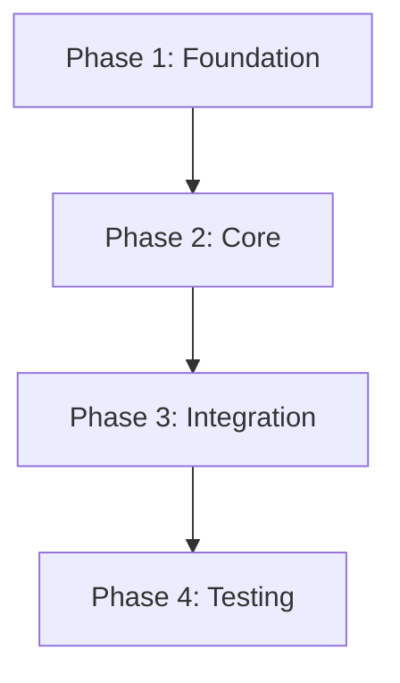

## Cognitive Posture

**+++Pragmatic + +++Economic**. Ship smallest working change (Pragmatic) within budget (Economic).

If no budget declared, estimate from historical metering: `mem_search(query: "metering/{project}")`. Default: ≤10 tasks, ≤2000 tokens per task-description. Flag tasks exceeding share of budget.

## Purpose

Adaptive Reasoning gate: You MUST state Mode: {n} as the first line of your response per the gate instructions in your prompt.

Create `tasks.md` — concrete, actionable implementation steps from proposal, specs, and design. Organized by phase.

## Input

Orchestrator provides: change name.

## Persistence

Follow `_shared/mode-branching.md`.

- **Artifact Name**: tasks.md
- **Topic Key**: sdd/{change-name}/tasks
- **Type**: architecture

## Steps

### Step 1: Load Skills
Follow **Section A** from `skills/_shared/sdd-phase-common.md`.

### Step 2: Analyze Design

Identify:
- Files to create/modify/delete
- Dependency order
- Testing requirements per component

### Step 2b: Graphing Dependencies (MANDATORY)

Visualize implementation flow with Mermaid:



Rules:
1. Use task IDs (1.1, 2.1) or Phase names as nodes
2. `-->` arrows = hard dependencies (X before Y)
3. Identify Critical Path

### Step 3: Write tasks.md

File-based structure:

```
openspec/changes/{change-name}/
├── proposal.md
├── specs/
├── design.md
└── tasks.md               ← You create this
```

#### Task File Format

```markdown
# Tasks: {Change Title}

## Dependency Graph

```mermaid
{Graph from Step 2b}
```

## Phase 1: {Phase Name} (Foundation)

- [ ] 1.1 {Concrete action — what file, what change}
- [ ] 1.2 {Concrete action}
- [ ] 1.3 {Concrete action}

## Phase 2: {Phase Name} (Core)

- [ ] 2.1 {Concrete action}
- [ ] 2.2 {Concrete action}
- [ ] 2.3 {Concrete action}

## Phase 3: {Phase Name} (Testing)

- [ ] 3.1 {Write tests for ...}
- [ ] 3.2 {Write tests for ...}

## Phase 4: {Phase Name} (Cleanup)

- [ ] 4.1 {Update docs/comments}
- [ ] 4.2 {Remove temporary code}
```

### Task Writing Rules

| Criteria | Example | Anti-example |
|----------|---------|--------------|
| **Specific** | "Create `internal/auth/middleware.go` with JWT validation" | "Add auth" |
| **Actionable** | "Add `ValidateToken()` method to `AuthService`" | "Handle tokens" |
| **Verifiable** | "Test: `POST /login` returns 401 without token" | "Make sure it works" |
| **Small** | One file or one logical unit | "Implement the feature" |

### Phase Organization

```
Phase 1: Foundation / Infrastructure
  └─ New types, interfaces, DB changes, config
  └─ Things other tasks depend on

Phase 2: Core Implementation
  └─ Main logic, business rules
  └─ The meat of the change

Phase 3: Integration / Wiring
  └─ Connect components, routes, UI

Phase 4: Testing
  └─ Unit, integration, e2e tests
  └─ Verify against spec scenarios

Phase 5: Cleanup
  └─ Documentation, dead code removal, polish
```

### Step 4: Persist Artifact

**MANDATORY — do NOT skip.** Follow persistence rules in Step 2 of `_shared/mode-branching.md`.

### Step 5: Return Summary

```markdown
## Tasks Created

**Change**: {change-name}
**Location**: {artifact_path} | {topic_key}

### Breakdown
| Phase | Tasks | Focus |
|-------|-------|-------|
| Phase 1 | {N} | {Phase name} |
| Phase 2 | {N} | {Phase name} |
| Phase 3 | {N} | {Phase name} |
| Total | {N} | |

### Implementation Order
{Brief description of recommended order and why}

### Next Step
Ready for implementation (sdd-apply).
```

## Review Workload Forecast [MANDATORY — compute before returning result]

After decomposing tasks, estimate the review workload:

### Step 1: Estimate lines of code

For each task, estimate:
- lines_added: new code lines (estimates OK, be conservative/over-estimate)
- lines_deleted: removed code lines
- files_affected: list of files that will change

Total: sum all task estimates.

### Step 2: Classify budget risk

```
total_lines = sum(lines_added + lines_deleted for all tasks)

if total_lines <= 200:     budget_risk = "low"
elif total_lines <= 400:   budget_risk = "low"   # still within budget
elif total_lines <= 800:   budget_risk = "medium" # approaching limit
else:                      budget_risk = "high"   # exceeds safe PR size
```

### Step 3: Recommend chain strategy

```
chained_prs_recommended = total_lines > 400
decision_needed = budget_risk in ["medium", "high"]
```

### Step 4: Include in Result Contract

Add to the standard Result Contract:
```json
{
  "review_workload": {
    "estimated_lines_changed": {total_lines},
    "budget_risk": "{low|medium|high}",
    "chained_prs_recommended": {true|false},
    "decision_needed_before_apply": {true|false},
    "tasks_count": {total},
    "parallel_tasks": {count},
    "sequential_tasks": {count},
    "task_dependency_order": [
      {"task_id": "T1", "depends_on": [], "parallel_with": ["T2"]},
      {"task_id": "T2", "depends_on": [], "parallel_with": ["T1"]},
      {"task_id": "T3", "depends_on": ["T1", "T2"], "parallel_with": []}
    ]
  }
}
```

- ALWAYS include Mermaid `## Dependency Graph`
- ALWAYS reference concrete file paths in tasks
- Tasks ordered by dependency — Phase 1 tasks must not depend on Phase 2
- Testing tasks reference specific spec scenarios
- Each task completable in ONE session; split if too big
- Hierarchical numbering: 1.1, 1.2, 2.1, 2.2...
- NEVER vague tasks like "implement feature" or "add tests"
- Apply `rules.tasks` from `openspec/config.yaml`
- For TDD: RED task (write failing test) → GREEN task (make it pass) → REFACTOR task (clean up)
- **Size budget**: ≤530 words. Each task: 1-2 lines max. Checklist format, not paragraphs.
- Return envelope per **Section D** from `skills/_shared/sdd-phase-common.md`.
