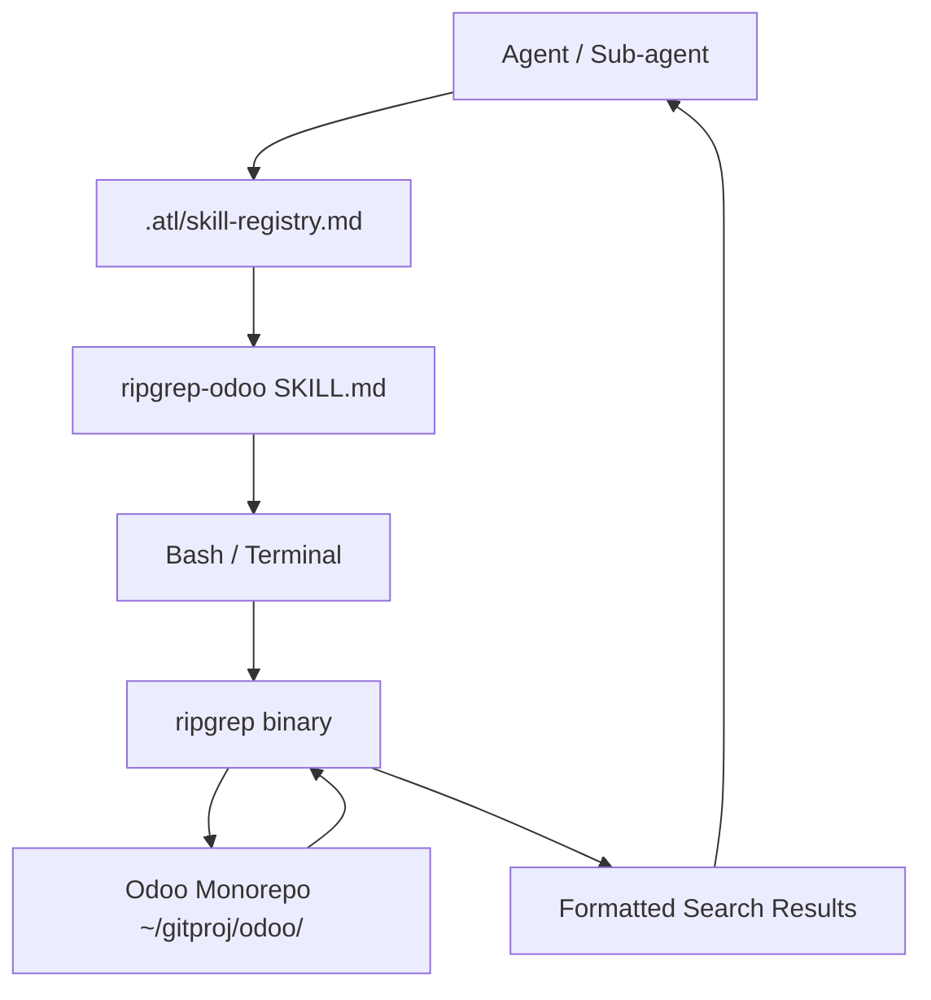

# Design: 04-ripgrep-odoo-local-skill

## Architecture Diagram

## Module/Component Boundaries
- **ripgrep-odoo**: A new directory under `internal/assets/overlays/odoo-development-skill/skills/` containing the `SKILL.md`.
- **Skill Registry**: Modified to include the new skill entry and its triggers.

## Data Flow
1. Agent identifies a need for Odoo-specific code discovery.
2. Agent consults the skill registry and loads `ripgrep-odoo`.
3. Agent follows instructions in `ripgrep-odoo/SKILL.md` to formulate an `rg` command.
4. Agent executes the command via the Bash tool.
5. Results are parsed and used for reasoning.

## Interface Contracts
- **Triggers**: `odoo`, `owl`, `o-spreadsheet`, `enterprise`, `oca`.
- **Paths**: Defaulting to `~/gitproj/odoo/`.
- **Command Syntax**: Standard ripgrep flags (`-t`, `-g`, `-C`, `--max-columns`).

## State Management
- Stateless. Each search is independent.

## Error Propagation Model
- Skill instructions mandate checking for `rg` exit codes.
- Path existence checks are performed before search.

## Integration Points
- Extends the existing Agent Skills ecosystem.
- Uses standard terminal tools (Bash).

## Alternative Designs Considered
- **Python-based adapter**: Rejected for complexity; direct `rg` is faster and more transparent for agents.
- **Generic ripgrep skill with Odoo params**: Rejected; specialized paths and flags reduce agent cognitive load and prevent errors.

## Rollback Strategy
- Remove the skill directory.
- Revert the registry entry.
- (Standard git revert).

## Open Questions
- Should the Odoo root path be configurable via an environment variable? (Recommendation: Keep it as a documentation-level variable for now).
