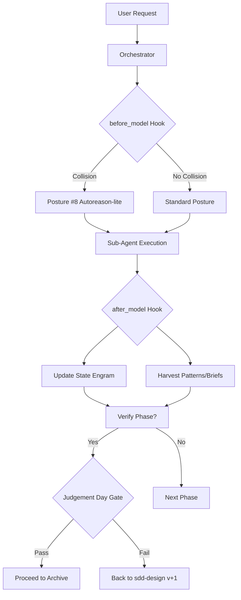

# Design: SDD Hooks and Judgement Day

## Architecture
The hooks will be implemented as discrete sections within the Orchestrator prompt template, ensuring they execute conceptually before and after every sub-agent "Turn".



## Component: before_model Hook
The logic will be appended to the "Sub-Agent Launch" section of the orchestrator assets.
```markdown
### before_model Hook
1. Execute `mem_search` for collisions and state.
2. If conflict detected, override posture and prepend warning to task.
3. Inject error context for apply/verify phases.
```

## Component: after_model Hook
The logic will be appended to the "Result Processing" section.
```markdown
### after_model Hook
1. Mandatory `mem_save` of DAG state.
2. Conditional `mem_save` of brief, patterns, and research findings.
```

## Component: Judgement Day Gate
This will be added as a supplement to the Odoo overlay verification protocol.
- **Trigger**: Final step of `sdd-verify` if Mode 1 and Complexity > 1.
- **Input**: Brief and Implemented Code.
- **Output**: Verdict + minimal correction.

## Implementation Plan
- Use a search-and-replace strategy to update all 11 `sdd-orchestrator.md` files.
- Directly edit the Odoo overlay verify supplement.
